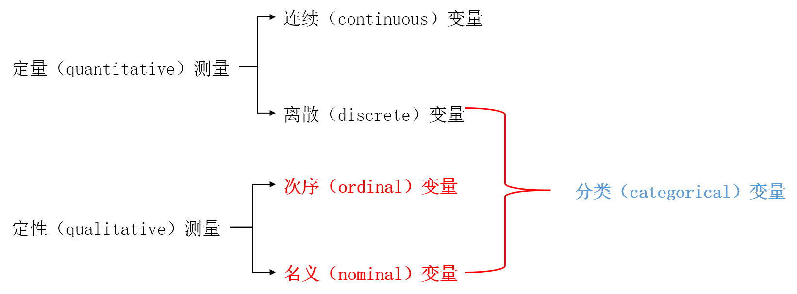
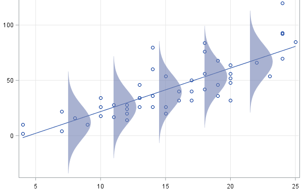
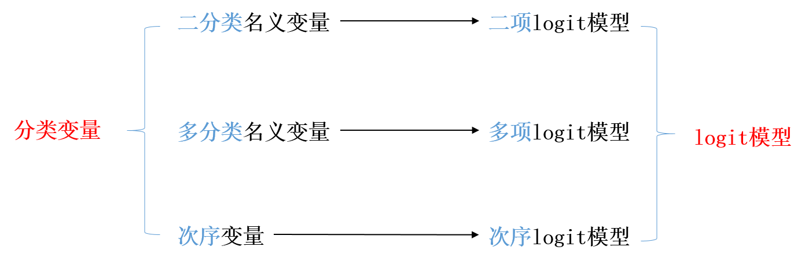

```{r setup, include = FALSE}

knitr::opts_chunk$set(echo = FALSE, warning = FALSE, message = FALSE)
options(digits = 2)

```


# 二项logistic回归

## 课程存储地址

- 课程存储地址： [https://github.com/wuhsiang/Courses](https://github.com/wuhsiang/Courses)
- 资源：课件、案例数据及代码

{width=40%}

## 参考教材

- 丹尼尔·鲍威斯，谢宇. 分类数据分析的统计方法（第二版）. 北京：社会科学文献出版社. 2018.

## 数据的测量类型

- 定量测量：数值有实质含义。包括连续变量（或定距变量）、离散变量（通常是计数变量）。
- 定性测量：数值**无实质含义**。包括次序变量和名义变量。
- 实践中的处理：李克特量表

{width=75%}

## 线性回归回顾

线性回归中，一组预测变量向量$X$只对应一个预测值$\hat{y}$，总体回归线穿过$(X^{k},E(y|X^{k}))$。

{width=60%}

## 分类因变量与线性回归模型

线性回归模型
$$
y = \beta X + \epsilon
$$
最关键的推导和设定包括两步：
$$
E(y|X) = \beta X + E(\epsilon|X), \text{ and } E(\epsilon|X) = 0.
$$
从而剥离出误差项$\epsilon$，并通过普通最小二乘法（OLS）得到最佳线性无偏估计量（best linear unbiased estimator, BLUE）。

$E(y|X)$对分类因变量\textcolor{red}{不适用}，因此分类因变量需要\textcolor{red}{新的统计模型}！

## 分类因变量与logistic回归

{width=90%}

## 二分类因变量

因变量只能在两个可能的数值中取值，要么“是”或者“发生”，要么“否”或者“未发生”。例如，患病、犯罪、抑郁、自杀等健康管理研究议题。

二分类因变量（binary dependent variable）：取值为二分类，两种可能结果被描述为“发生”或者“不发生”。研究关注的结果视作“发生”，且编码为1；另一结果则被视为“不发生”，且编码为0。即因变量$y \in {0, 1}$。但0和1不具有\textcolor{red}{数值上}的实质意义。

研究者目的在于，估计或预测\textcolor{red}{事件发生的概率}如何受到自变量的影响。相应地，每个独立样本可以视作一次**伯努利试验**（Bernoulli trial），试验结果要么是1（发生），要么是0（不发生）。

## 线性概率模型

研究者目的在于，估计或预测\textcolor{red}{事件发生的概率}$p$如何受到自变量的影响。

**线性概率模型**（linear probability model, LPM）**直接**用自变量$X$来解释事件发生概率$p$：
$$
p_{i} = \beta X + \epsilon_{i}.
$$
但LPM存在异方差问题，同时预测值$\hat{p}_{i}$很可能落在$[0,1]$区间以外。因而，LPM随即被logit和probit模型取代。


## 发生比率（odds）

事件的\textcolor{red}{发生比率}（odds），定义为事件发生的概率$p$与不发生的概率$(1-p)$的比率：
$$
\text{odds} = \frac{p}{1 - p}.
$$
此时$\text{odds} \in [0, \infty]$。

进一步，\textcolor{red}{对数发生比率}（log-odds），也称为发生概率$p$的\textcolor{red}{logit}：
$$
\text{logit}(p) = \text{log}(\frac{p}{1-p}).
$$
显然，$\text{logit}(p) \in (- \infty, \infty)$。$p \rightarrow 0$时，$\text{logit}(p) \rightarrow - \infty$；$p \rightarrow 1$时，$\text{logit}(p) \rightarrow \infty$。

## 二项logistic回归

二项logistic回归认为，$\text{logit}(p_{i})$是自变量$X_{i}$的线性函数。
$$
\text{log}(\frac{p_{i}}{1-p_{i}}) = \text{logit}(p_{i}) = \beta X_{i} + \epsilon_{i}.
$$
从而，事件发生概率
$$
p_{i} = \text{logistic}(\beta X_{i}) = \frac{\text{exp}(\beta X_{i})}{1 + \text{exp}(\beta X_{i})}.
$$

注：$\text{logit}(\cdot)$与$\text{logistic}(\cdot)$互为逆函数（inverse function）。

通过\textcolor{red}{最大似然估计}（maximum likelihood estimation, MLE）方法，得到参数$\beta$的估计值$\hat{\beta}$。

## 参数解释

[\textcolor{blue}{二项logistic回归案例:健康信息搜寻行为}](https://github.com/wuhsiang/Courses/blob/master/econometricsintro/cases/case-hisb.pdf)

## 发生比率比（odds ratio）


## 相对风险（relative risk）

## 似然函数

**问题**：箱子里有10个球，或是白球，或是黑球。从中有放回地取出5个球，得到结果：{白球、白球、白球、黑球、白球}。请估计，箱子中有几个白球、几个黑球？

**建模**：令$p \in [0, 1]$：箱子中白球的比例，事件$A$：取出的球是白球。那么，单次伯努利试验中事件$A$发生的概率为$p$。样本观测值为：{1,1,1,0,1}。

**分析**：给定参数$p$，得到以上观测数据$D$的概率是，$\text{Prob}(D|p) = p \times p \times p \times (1-p) \times p = p^{4} (1-p)$。

以上概率是未知参数$p$的函数，称为**似然函数**（likelihood function），表述为$L(p) = \text{Prob}(D|p) = p^{4} (1-p)$。

## 最大似然估计

更一般化，给定**参数**$\theta$和**观测数据**$D$，似然函数$L(\theta) = \text{Prob}(D|\theta)$是未知参数$\theta$的函数，刻画了给定参数$\theta$时观测到数据$D$的概率。

\textcolor{red}{最大似然估计}（maximum likelihood estimation, MLE）的逻辑：找到$\theta = \hat{\theta}$，使似然函数$L(\theta)$取最大值。换言之，使得数据$D$以最大可能性被观测到的参数值$\hat{\theta}$即为最大似然估计值。通常$L(\theta) \in (0, 1)$极小，因而参数估计时使用其对数$LL(\theta)$。

以上例子中，$LL(p) = 4 \text{log}(p) + \text{log}(1-p)$。当$p = 0.8$时，$LL(p)$取得最大值。因此，我们估计箱子中白球的比例是$\hat{p} = 0.8$，亦即箱子中有8个白球、2个黑球。

## 二项logistic回归的参数估计

二项logistic回归的似然函数
$$
L(\beta) = \prod_{i=1}^{n} p_{i}^{y_{i}} (1 - p_{i})^{(1-y_{i})}
$$
进一步，对数似然函数
$$
LL(\beta) = \sum_{i=1}^{n} y_{i} \cdot \text{log}(p_{i}) + (1-y_{i}) \cdot \text{log} (1 - p_{i}).
$$
可以使用最大似然估计得到参数估计值$\hat{\beta}$。

## 分类数据的哲学视角

1. 变换方法（transformational approach）
2. 潜变量方法（latent variable approach）

## 变换方法

## 潜变量方法

# 多项logistic回归

## 多项logistic回归

# 次序logistic回归

## 次序logistic回归


## logistic回归总结

1. 二项logistic回归
2. 多项logistic回归
3. 次序logistic回归
