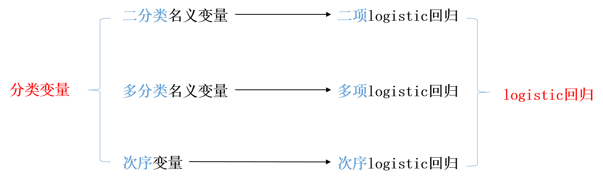

```{r setup, include = FALSE}

knitr::opts_chunk$set(echo = FALSE, warning = FALSE, message = FALSE)
options(digits = 2)

```


# 二项logit模型

## 课程存储地址

- 课程存储地址： [https://github.com/wuhsiang/Courses](https://github.com/wuhsiang/Courses)
- 资源：课件、案例数据及代码

{width=40%}

## 参考教材

- 丹尼尔·鲍威斯，谢宇. 分类数据分析的统计方法（第二版）. 北京：社会科学文献出版社. 2018.

## 数据的测量类型

- 定量测量：数值有实质含义。包括连续变量（或定距变量）、离散变量（通常是计数变量）。
- 定性测量：数值**无实质含义**。包括次序变量和名义变量。
- 实践中的处理：李克特量表

{width=75%}

## 线性回归回顾

线性回归中，总体回归线穿过$(X^{k},E(y|X^{k}))$。

{width=60%}

## 分类因变量与线性回归模型

线性回归模型
$$
y = \beta X + \epsilon
$$
最关键的推导和设定包括两步：
$$
E(y|X) = \beta X + E(\epsilon|X), \text{ and } E(\epsilon|X) = 0.
$$
从而剥离出误差项$\epsilon$，并通过普通最小二乘法（OLS）得到最佳线性无偏估计量（best linear unbiased estimator, BLUE）。

$E(y|X)$对分类因变量\textcolor{red}{不适用}，因此分类因变量需要新的模型！

## 分类因变量与logit模型

{width=90%}

## 二分类因变量

二分类因变量（binary dependent variable）

## 发生比率（odds）


## 发生比率比（odds ratio）


## 相对风险（relative risk）

## 分类数据的哲学视角

1. 变换方法（transformational approach）
2. 潜变量方法（latent variable approach）

## 变换方法

## 潜变量方法

# 多项logit模型

## 多项logit模型

# 次序logit模型

## 次序logit模型


# 离散选择模型（*）

## 离散选择模型

## logit模型总结

1. 二项logit模型
2. 多项logit模型
3. 次序logit模型
4. 离散选择模型（*）
