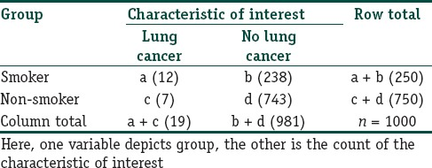
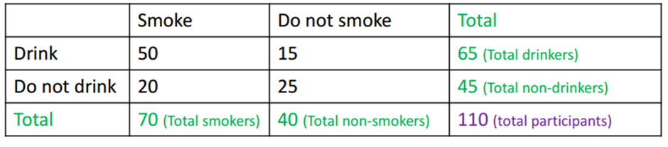

```{r setup, include = FALSE}

knitr::opts_chunk$set(echo = FALSE, warning = FALSE, message = FALSE)
options(digits = 2)

```


# 分类模型概述

## 医疗卫生领域中的分类问题

- 健康生活方式
- 社会参与方式
- IT使用方式
- 疾病诊断

## 两种哲学观点

分类变量在\textcolor{red}{本质上}是离散的，还是连续的？

- **统计学视角**：认为分类变量在本质上是\textcolor{red}{离散}的，且依赖数据的变换来推导回归类模型，亦即\textcolor{red}{变换方法（transformational approach）}。这一方法的统计建模意味着，分类因变量在经过某种变换之后，其\textcolor{red}{条件期望}可以表达成自变量的线性函数。此类变换函数称为\textcolor{red}{链接函数}（link functions），而这类模型则统称为\textcolor{red}{广义线性模型}。
- **计量经济学视角**：认为分类变量背后存在一个连续的、未观测到的变量，即\textcolor{red}{连续的潜变量}（latent variable）。当该潜变量越过某个\textcolor{red}{阈值}，观测到的分类变量取值就会变化，亦即\textcolor{red}{潜在变量方法（latent variable approach）}。这一方法认为，分类变量有别于通常的连续变量，在于它的\textcolor{red}{部分可观测性}（partial observability）。因此，统计建模意味着，探讨自变量如何影响潜在的连续变量（即\textcolor{red}{结构分析}）而非观测到的分类变量。

## 潜在变量方法：议题理解

请根据自己的理解，讨论以下二分类或多分类变量的情形：

- 如何理解个体是否患病？
- 如何理解消费者的产品购买行为？
- 如何理解消费者的品牌选择行为？
- 如何理解已婚妇女是否进入劳动力市场？

## 潜在变量方法：统计建模

考虑二分类因变量$y$，其背后的连续潜在变量记为$y^{*}$，且阈值交叉（threshold-crossing）测量模型为：
$$
y_{i} =
\begin{cases}
1 & \text{ if } y_{i}^{*} > 0; \\
0 & \text{ otherwise}.\\
\end{cases}
$$

统计建模则是建立连续的潜在变量$y^{*}$与自变量$\textbf{x}$的关系：
$$
y^{*}_{i} = \beta \textbf{x}_{i} + \epsilon_{i}, \text{ and } 1 \leq n \leq N.
$$

至此，与线性回归模型无异。

## 变换方法

变换方法核心在于如何寻找\textcolor{red}{合适的变换}，主要包括：

- 线性概率模型
- Logit模型
- Probit模型

变换方法与潜在变量方法在统计结果上并无太大差异，关键在于其哲学基础和理解方式。统计学领域通常采用变换方法来解释模型，而计量经济学领域则通常采用潜在变量方法来解释模型，因其能够奠基于诸如效用（utility）、支付意愿（willingness to pay, WTP）等\textcolor{red}{经济学概念}之上。

## 聚类及判别分析

传统方法：

- 聚类分析：K-means聚类、层次聚类（注：诸如模糊聚类、灰色聚类等方法已被历史淘汰，\textcolor{red}{请勿再用}！）
- 判别分析：线性判别分析，二次判别分析

潜在变量方法：

- 潜在类别模型：潜在类别分析（latent class analysis, LCA）、潜在剖面分析（latent profile analysis, LPA）

## 潜在变量视角

如何从潜在类别视角理解开篇提出的如下问题：

- 健康生活方式
- 社会参与方式
- IT使用方式
- 疾病诊断

# 聚类模型

## 聚类模型（clustering models）

聚类分析（clustering）试图从观测数据中寻找**同质子类**，属于**无监督学习**（unsupervised learning）的范畴。基本聚类模型包括：

1. $K$均值聚类（$K-$means clustering）
2. 层次聚类（hierarchical clustering）

原理：将观测样本分割到不同的类（cluster）中，使每个类内的观测彼此相似，而不同类中的观测彼此差异很大。

**课堂讨论：比较聚类与PCA、FA、ANOVA、线性回归**

## $K$均值聚类

$k$均值聚类通过**最小化类内差异**而得到聚类结果：
$$
\text{min} \sum_{k=1}^{K} W(C_{k}).
$$
$W(\cdot)$衡量类内差异，例如可以采用欧氏距离计算。

$k$均值聚类算法如下：

1. 为每个观测样本随机分配一个初始类$k (1 \leq k \leq K)$。
2. 重复以下操作，直至类的重分配停止为止：

    - 分别计算$K$个类的中心。第$k$个类中心是其类内$p$维观测样本的均值向量。
    - 将每个观测样本分配到距离其最近的类中心所在的类中。

**课堂讨论：是否存在其它思路？**

## $K$均值聚类示意图

{width=60%}

## 层次聚类

层次聚类（hierarchical clustering）算法如下：

1. 每个观测样本自成一类，共有$n$个初始类。计算所有$n(n-1)/2$对观测样本（类）之间的相异度。
2. 令$i = n, n-1, ..., 2$：

    - 在$i$个类中，比较任意两类间的相异度，找到相异度最小的两类，将其合并起来。用两个类之间的相异度表示这两个类在谱系图中交汇的高度。
    - 计算剩下的$i-1$个新类中，每两个类间的相异度。

层次聚类采用逐步归并的方式，构建了谱系图（dendrogram），从而允许任意的类别数量。

## 距离测度

通常采用聚类来衡量相异度，常见距离形式包括：最长（complete）距离法、类平均法（average）、最短（single）距离法和重心法（centroid）。

{width=50%}

## 层次聚类示意图


{width=70%}


# 线性判别分析

## 贝叶斯定理

贝叶斯定理阐述了随机变量$X$和$Y$的条件概率之间的关系：
$$
p(Y|X) = \frac{p(X,Y)}{p(X)} = \frac{p(Y) \cdot p(X|Y)}{p(X)}.
$$

或从“数据-参数”的视角而言，参数$\theta$的\textcolor{red}{后验分布}$\pi({\theta}) = p(\theta|D)$正比于参数的\textcolor{red}{先验分布}$p(\theta)$和\textcolor{red}{似然函数}$l(\theta)$之积：
$$
\pi(\theta) = \frac{p(\theta)p(D|\theta)}{p(D)} = \frac{p(\theta) l(\theta)}{p(D)}.
$$

**课堂板书：贝叶斯定理推导及概念解释**

## 贝叶斯定理与分类

对于分类（categorical）响应变量$Y$而言，运用贝叶斯定理：
$$
p(Y = k|X = x) = \frac{p(Y = k) \cdot p(X = x|Y = k)}{p(X = x)}.
$$
假定$x$是$m$维向量（即特征数量），简写为
$$
p(C_{k}|x) = \frac{p(C_{k}) \cdot p(x|C_{k})}{p(x)} \propto p(C_{k}) \prod_{i=1}^{m} p(x_{i}|C_{k})
$$

## 贝叶斯分类器

\textcolor{red}{贝叶斯分类器}（bayesian classifier）选择后验概率$p(C_{k}|x)$最大的类别，作为分类结果，即$\text{argmax } p(C_{k}|x)$。

可以证明，贝叶斯分类器将产生最低的测试错误率，亦即\textcolor{red}{贝叶斯错误率}。相应用于分类的边界，成为贝叶斯决策边界（bayes decision boundary）。

问题在于，如何推导出后验概率$p(C_{k}|x)$？我们需要更多\textcolor{red}{假设}。


## LDA

\textcolor{red}{线性判别分析}（linear discriminant analysis, LDA）假定$p(x|C_{k}) \sim N(\mu_{k}, \Sigma)$。LDA即是条件概率$p(x|C_{k})$为（多元）正态分布时的贝叶斯分类器，其判别函数$f(x)$为线性函数。

考虑$x$是一维的情况，
$$
p(x|C_{k}) = \frac{1}{\sqrt{2\pi}\sigma} \text{exp}[-\frac{1}{2\sigma^{2}}(x-\mu_{k})^{2}],
$$
由此根据后验概率$p(C_{k}|x)$的对数，得到如下判别函数
$$
f_{k}(x) = x \cdot \frac{\mu_{k}}{\sigma^{2}} - \frac{\mu_{k}^{2}}{2\sigma^{2}} + \text{log}[p(C_{k})].
$$

**课堂板书：推导判别函数**

## LDA示意图

{width=75%}

# 潜在类别分析

## 列联表模型

考虑最简单的$2 \times 2$列联表：

{width=75%}

## 样本概率

在$I \times J$列联表中，第$i$行第$j$列的观测频次和样本概率记为$f_{ij}$和$p_{ij}$，其中$1 \leq i \leq I$，$1 \leq j \leq J$。

\textcolor{red}{行边缘概率}：第$i$行的边缘概率为
$$
p_{i+} = \sum_{j = 1}^{J} p_{ij}.
$$

\textcolor{red}{列边缘概率}：第$j$列的边缘概率为
$$
p_{+j} = \sum_{i = 1}^{I} p_{ij}.
$$

## 期望概率

若行变量与列变量独立，那么可以得到期望联合概率：
$$
P_{ij} = p_{i+} \times p_{+j}.
$$
若样本量为$n$，则\textcolor{red}{期望频次}为
$$
F_{ij} = n \times P_{ij}.
$$

## 独立性检验

通常使用\textcolor{red}{皮尔逊卡方}来检验行变量和列变量之间的\textcolor{red}{独立性}，即
$$
\chi^{2}_{(I - 1)(J - 1)} = \sum_{i=1}^{I} \sum_{j=1}^{J} \frac{(F_{ij} - f_{ij})^{2}}{F_{ij}}
$$
服从于自由度为$(I-1)(J-1)$的卡方分布。

## 另一例子

列联表的另一例子如下：

{width=75%}

**课堂讨论：以上例子和smoke & lung cancer的例子有何不同？**

## 虚假相关问题

- 当卡方检验显著时，是否意味着行变量与列变量相关？
- 在列联表分析中，是否存在\textcolor{red}{虚假相关问题}？
- 如果出现虚假相关问题，应如何解决？

**课堂讨论：虚假相关与内生性问题**

## 潜在变量模型描述

假设$Y_{ik}$是第$i$个样本在第$k (1 \leq k \leq K)$个\textcolor{red}{外显变量}（observed, or manifest variable）上的取值，$Y_{ik}$是分类变量，且第$k$个外显变量的取值为$l_{k}$，其中$1 \leq l \leq L$。

如果出现了$Y_{k}$之间的\textcolor{red}{虚假相关}问题，是否存在\textcolor{red}{潜在变量}（unobserved, or latent variable）$X$，可以解释外显变量$Y_{k}$之间的相关性？这就是\textcolor{red}{潜在变量模型}（latent class model, LCM）试图解决的问题。

## LCM基本假设

- \textcolor{red}{局部独立假设}：存在潜在类别变量$X$，有$T$个水平，即代表$T$个潜在类别。那么，给定潜在类别变量$X$，各个外显变量之间局部独立，即不相关。那么观测到$K$个外显变量取值为$l$的概率为：
$$
P(\textbf{y}_{i} = l | X_{i} = t) = \prod_{k=1}{K} P(Y_{ik} = l_{k} | X_{i} = t).
$$

- \textcolor{red}{互斥性假设}：观测到$K$个外显变量取值为$l$的概率，等于以潜在类别概率为权向量的该取值的条件概率之和：
$$
P(\textbf{y}_{i} = l) = \sum_{t=1}^{T} P(X_{i} = t) \times P(\textbf{y}_{i} = l | X_{i} = t).
$$

## 估计方法

从零模型开始逐渐增加潜在类别$T$的数目，在参数限定的基础上运用极大似然法（MLE）估计各模型，比较各模型的适配结果，直至找到最佳模型为止。

\textcolor{red}{模型选择}（model selection）方法主要包括似然比卡方检验，以及AIC和BIC两个信息评价指标（information evaluation criteria）。

## 研究案例

- 地位束缚与生活方式转型：中国各社会阶层健康生活方式潜在类别研究, 《社会学研究》, 2017.6.
- 亲近还是疏离？乡城人口流动背景下农民工家庭的代际关系类型分析, 《人口研究》, 2015.5.

## 潜在类别模型的价值

- 适用于\textcolor{red}{社会科学研究}：大部分社会科学调查数据，均存在较多分类变量，且很多分类变量指向了同一议题，例如健康生活方式，代际关系，社会参与方式等。（对比：Likert量表得到的连续变量数据）
- 经济学中的使用场景：如市场营销中的细分市场识别，及各细分市场的特征。
- 使用难点：如何\textcolor{red}{重编码}（recode）分类数据，以更好地拟合模型和解释结果。例如将10分类的教育程度变量，重编码为3分类。

## 课堂讨论

请回顾各自的统计方法学习和研究设计经历。

在研究过程中，有哪方面的统计建模或统计应用问题？
